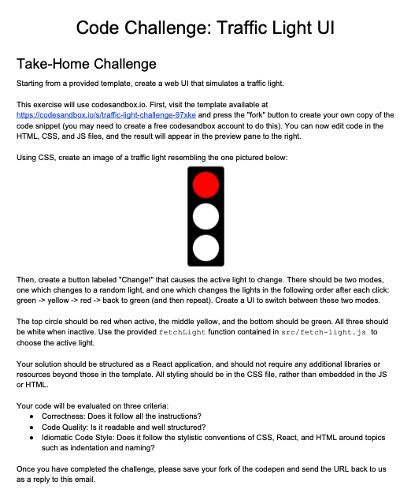

# Traffic Light Challenge

### Given the instructions below create a web UI that simulates a traffic light

[Traffic Light Challenge Instructions](https://docs.google.com/document/d/1UZQ8iVIkHc4NWLebHNw_D5nM1mmcdmNirXiDhQOsu20/edit#heading=h.16mzy33bzh8h)

[codesandbox phase_1](https://codesandbox.io/s/traffic-light-challenge-phase1-dbdre)

### Getting Started with Create React App

This project was bootstrapped with [Create React App](https://github.com/facebook/create-react-app).

#### Available Scripts

In the project directory, you can run:

##### `npm start`

Runs the app in the development mode.\
Open [http://localhost:3000](http://localhost:3000) to view it in the browser.

The page will reload if you make edits.\
You will also see any lint errors in the console.